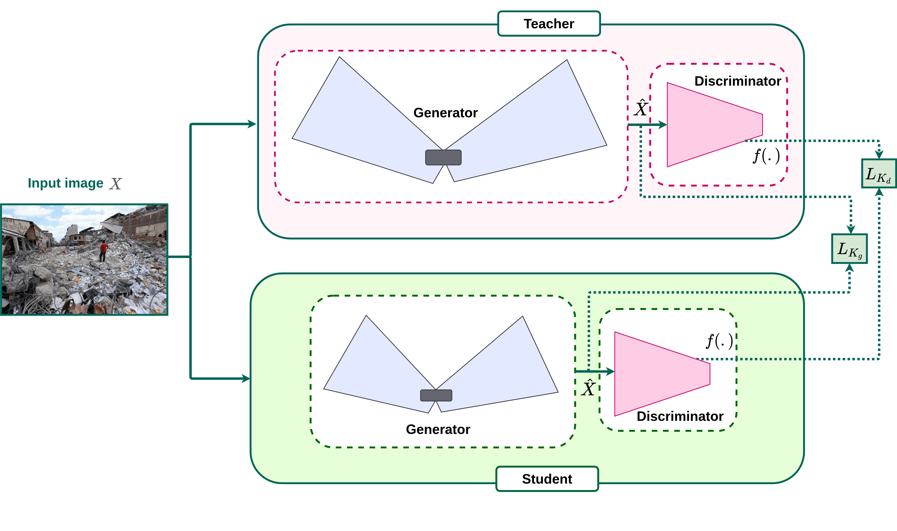
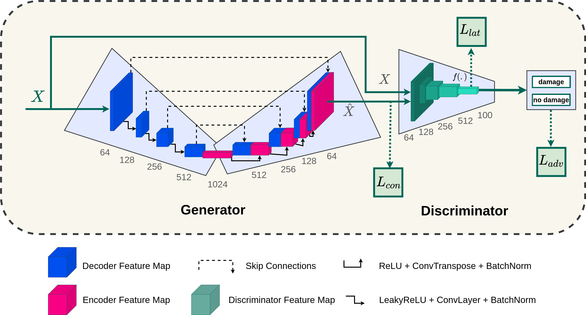

# Deep-Disaster 

This repository contains Pytorch implementation for training and evaluating of the following paper:
Deep-Disaster: Unsupervised Disaster Detection and Localization Using Visual Data [[1]](#6-reference)

  
<!--  -->


#### Thanks to these repos [skip-ganomaly](https://github.com/samet-akcay/skip-gano) and [Knowledge_Distillation_AD](https://github.com/rohban-lab/Knowledge_Distillation_AD)

## Installation
1. clone this repository
   ```
   git clone https://github.com/soroorsh/deep-disaster.git
   ```
2. Create the virtual environment via conda
    ```
    conda create -n deepdisaster python=3.7
    ```
3. Activate the virtual environment.
    ```
    conda activate deepdisaster
    ```
4. Install the dependencies.
   ```
   pip install -r requirements.txt
   ```
## Dataset:
This repository employ disaster detection on DAD dataset.
To use this dataset: 
  1. Download from [here](https://crisisnlp.qcri.org/data/ASONAM17_damage_images/ASONAM17_Damage_Image_Dataset.tar.gz)
  2. Unpack it into the `data` folder.  
  3. Prepare data such as this file structure: 
  ```
├── test
│   ├── 0.nodamage
│   │   └── nodamage_test_img_0.png
│   │   └── nodamage_test_img_1.png
│   │   ...
│   │   └── nodamage_test_img_n.png
│   ├── 1.damage
│   │   └── damage_test_img_0.png
│   │   └── damage_test_img_1.png
│   │   ...
│   │   └── damage_test_img_m.png
├── train
│   ├── 0.nodamage
│   │   └── nodamage_train_img_0.png
│   │   └── nodamage_train_img_1.png
│   │   ...
│   │   └── nodamage_train_img_t.png

``` 
To train the model on your custom dataset, you could copy the dataset into `./data` directory or set the --dataroot argument. 

## Training and Testing
To list the training parameters, run the following command:
```
python train.py -h
```
### To train the model on the DAD dataset:
``` 
python train.py --dataset <class_name> --niter <number-of-epochs>                                                
```
### To test the model on the DAD dataset:
``` 
python test.py --dataset <class_name> --load_weights                                                 
```

### To localize the damages, run the following command:

``` 
python test.py --dataset <class_name> --load_weights --localization_test                                               
```
###### For Localization test you should remove the `nodamage` folder in `{dad_class_name}/test/` folder.

<!-- ## Citating Deep-Disaster
If you want to cite this work in your publication:
``` bash
@article{,
  title={Deep-Disaster: Unsupervised Disaster Detection and Localization Using Visual Data},
  author={Shekarizadeh, Soroor and Rastgoo, Razieh and Al-Kuwari, Saif and Sabokrou, Mohammad},
  year={2022},
  eprint={},
  archivePrefix={arXiv},
  primaryClass={cs.CV}
}
``` -->
## Reference
[1] [Deep-Disaster: Unsupervised Disaster Detection and Localization Using Visual Data](https://arxiv.org/pdf/).

